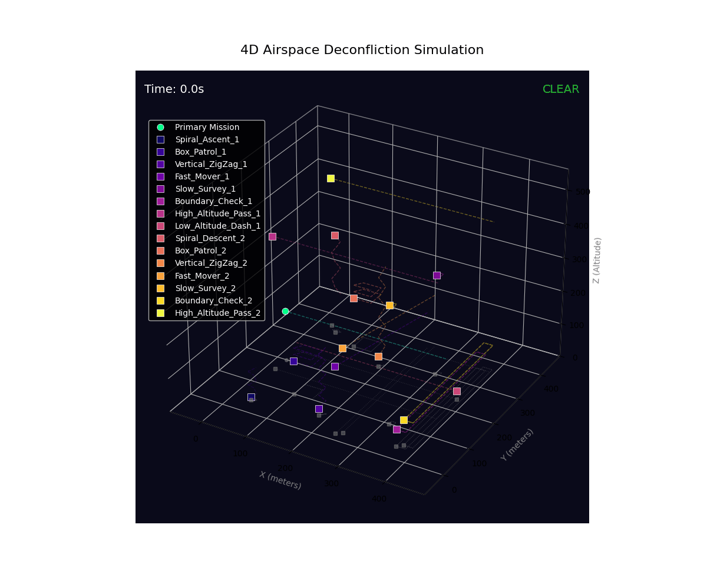

# 🚀 SkyGuard: Your Personal Air Traffic Controller

<p align="center">
  
</p>

<p align="center">
  <i>Ever tried to throw a paper airplane in a room full of other paper airplanes? It's chaos!</i><br>
  <b>SkyGuard is the tool that makes sure your drone isn't that paper airplane.</b>
</p>

## 🤔 So, What's the Big Idea?

Imagine a busy sky, buzzing with drones delivering packages, taking photos, and surveying land. Now, you want to launch your own drone on a mission. How do you make sure it doesn't cause a mid-air traffic jam?

That's where SkyGuard comes in. It's a strategic deconfliction system that acts as a final "Go/No-Go" authority. Before you take off, you show SkyGuard your flight plan, and it looks into the future to see if you'll get too close to any other drone, checking for conflicts in both space and time.

## ✨ Core Features: What's in the Box?

- 🔮 **Crystal Ball**: Sees the future flight paths of all drones and predicts potential conflicts before they happen.
- 🗺️ **3D Mission Command**: An interactive 3D interface where you can watch the entire airspace live and visually plan your mission.
- 🚦 **Instant Traffic Light**: Get a simple "CLEAR" or "CONFLICT" status for your planned mission in seconds.
- 🎯 **Laser-Point Accuracy**: If a conflict is found, it doesn't just wave a red flag. It pinpoints the exact location and time of the potential incident and shows you on the map.

## 🕹️ Getting Started: Your First Flight

Ready to take control? Getting SkyGuard running is a breeze.

### Clone the Mothership
Get the project code onto your local machine:

```bash
git clone https://github.com/Shawn2099/UAV-Deconflictor.git
cd UAV-Deconflictor
```

### Assemble Your Tools
**Prerequisites**: Python 3.8+ and pip

Install all the necessary Python libraries:
Open a terminal in the project folder and run this command to install all the necessary Python libraries from our list.

```bash
pip install -r requirements.txt
```

### Power Up the Engine
To launch the interactive web UI, run the server.py script. This starts the backend brain.

```bash
python server.py
```

### Launch Mission Control!
Open your favorite web browser and navigate to the mission_control.html file. You are now in command!

## 🛠️ The Tech Stack: What Makes It Tick?

This project was brought to life with a stack of modern and powerful technologies:

- **The Brain (Backend)**: Python, Flask, Flask-SocketIO
- **The Command Center (Frontend)**: HTML, JavaScript, Tailwind CSS
- **The 3D Holodeck**: Three.js
- **The Rocket Fuel for Math**: NumPy
- **The Quality Assurance Crew**: Pytest, Hypothesis

## 👨‍💻 For the Curious Engineer: A Look Under the Hood

Want to dig deeper? Here's how the project is laid out.

### The Blueprint (Project Structure)

```
UAV-Deconflictor/
├── src/                  # The core logic and "secret sauce"
│   ├── deconfliction_logic.py
│   ├── data_models.py
│   ├── visualization.py
│   └── utils.py
├── tests/                # Our army of testing robots
│   ├── test_deconfliction_logic.py
│   └── test_data_models.py
├── cypress/              # E2E testing suite
│   └── e2e/
├── config.json           # System configuration
├── scenarios.json        # Test scenarios
├── mission_control.html  # The interactive 3D user interface
├── main.py               # A powerful command-line tool for automation
├── server.py             # The backend server for the UI
└── README.md             # You are here!
```

### The Automation Tool (main.py)

For developers and automation, main.py provides a way to run checks without the UI. It's controlled with command-line arguments:

- `--scenarios [FILE_PATH]`: Specify a custom scenario file to run.
- `--config [FILE_PATH]`: Use a different configuration file.
- `--visualize`: A fun extra! Add this flag, and the script will generate a .gif animation of the scenario it just checked.

**Example Command:**
```bash
python main.py --scenarios scenarios.json --visualize
```

## 🧪 Testing Your Sky Traffic Control

Want to make sure everything works perfectly? We've got you covered:

```bash
# Run all tests
python -m pytest tests/

# Run the basic web interface tests
./run-basic-tests.bat  # Windows
```

## 🎯 What Makes This Special?

SkyGuard isn't just another drone tool - it's a complete airspace management solution that combines:

- **Advanced Mathematics**: Uses 4D conflict detection algorithms (3D space + time)
- **Real-time Simulation**: Live updates at 10Hz for precise monitoring
- **Professional Visualization**: Animated GIFs and 3D interfaces for clear understanding
- **Robust Testing**: Over 200 test cases ensuring reliability
- **Easy Integration**: Simple API for integration with existing drone systems

---

*Built with ❤️ for safer skies*
